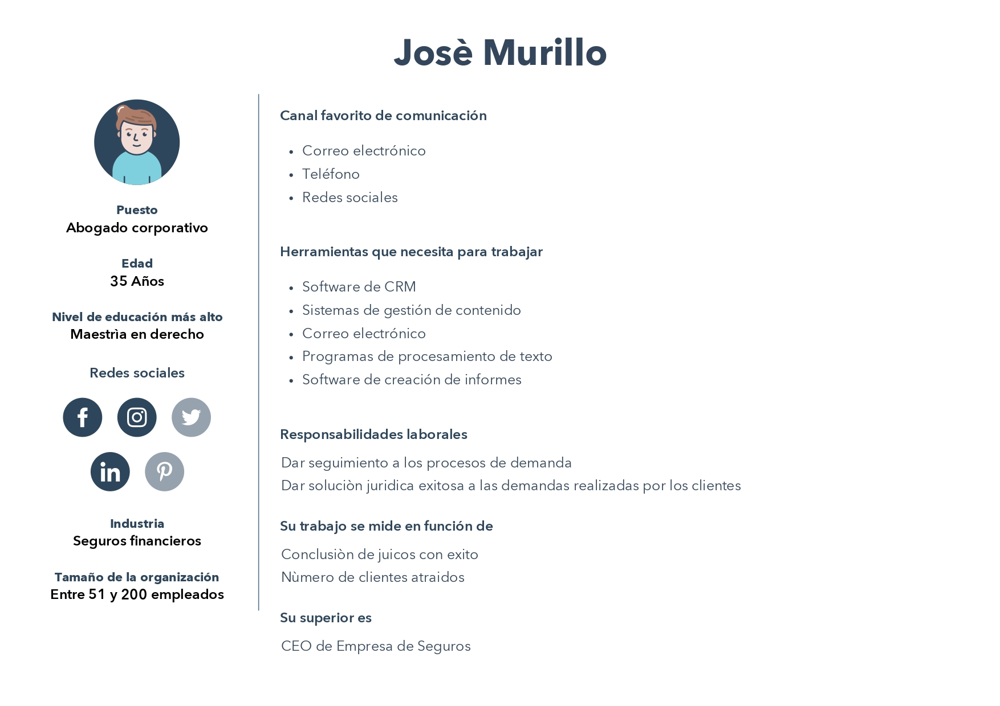
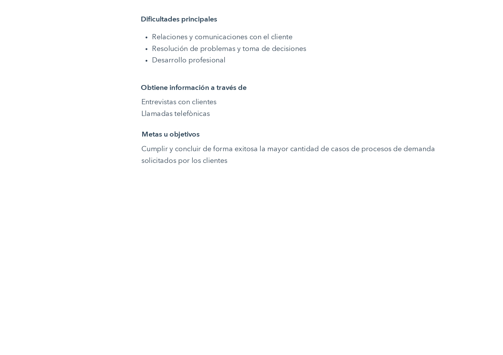
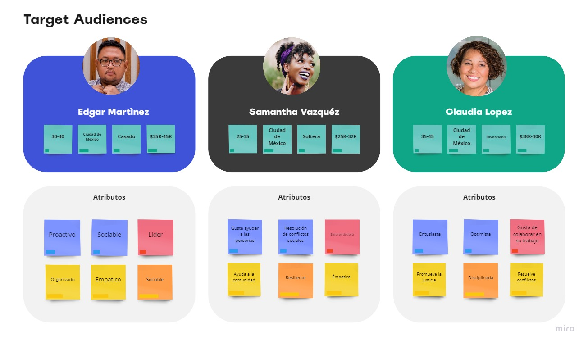
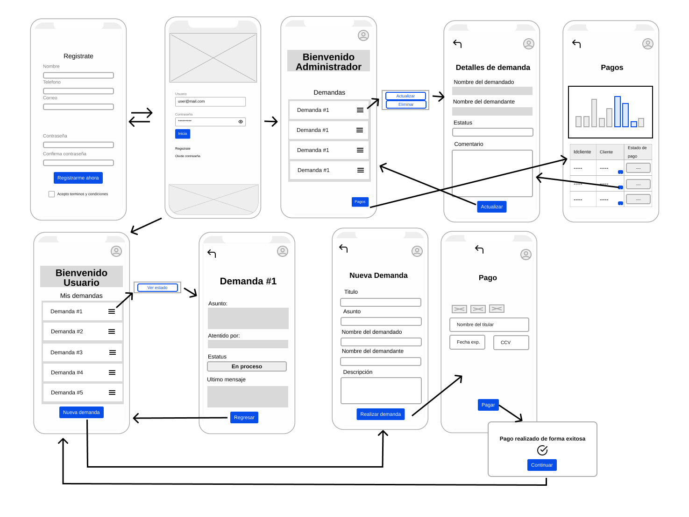

# Abogabot

## 1. Requerimientos funcionales

* ### Administrador

1. Requiere  **recibir** notificaciones de las demanas realizadas por los clientes.
2. Requiere **obtener** un documento en formato WORD(.docx) que contengan los datos ingresados por el cliente.
3. Requiere **visualizar y listar** los pagos realizados por los clientes en un **Dashboard**.
4. Requiere **actualizar** el proceso de demanda segun el seguimiento realizado.
5. Requiere **comentar** acerca de las actualizaciones del proceso de demanda.

* ### Cliente

1. Requiere un formulario que permita ingresar sus datos con respecto al proceso de demanda.
2. Requiere poder crear una cuenta de usuario con la cual pueda dar seguimiento a sus solicitudes.
3. Requiere un formulario para realizar su proceso de pago.
4. Requiere recibir notificaciones sobre las actualizaciones de su proceso de demanda.

### Requerimienos no Funcionales

1. La aplicación debe ser responsive, para que se pueda adaptar facilmente a diferentes tipos de dispostivos.
2. La aplicación debe contener los colores azul marino y blanco.

A continuacion se presenta la propuesta de **diagrama de flujo** para la aplicación:

## 2. Buyer de Persona

Es aquel que representa el cliente ideal para la aplicación.

Se empleo la herramienta https://www.hubspot.es/make-my-persona para el desarrollo de esta plantilla.

## 3. Público objetivo

Se define como los posibles compradores de la aplicación

Se empleo la herramienta https://miro.com/es/plantillas/publico-objetivo/ para esta plantilla

## 4. Wireframe UX

A continuación se presenta la experiencia del usuario en la aplicación, al momento de su interacción.

Se empleó la herramienta https://miro.com/es/

