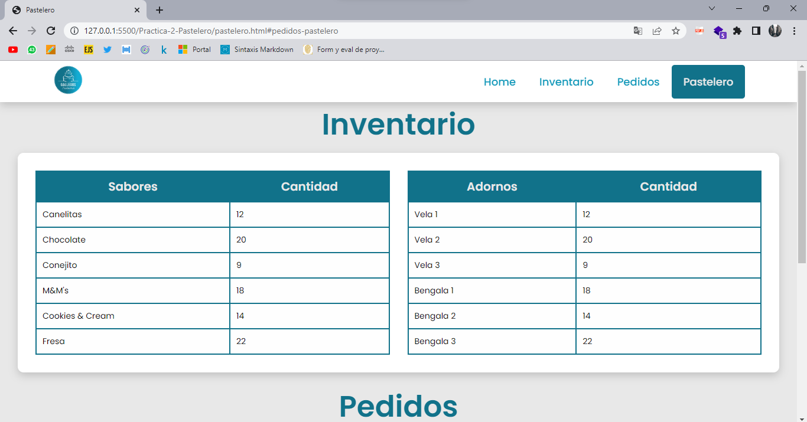

# Pasteleria

## Descripción

Se desarrollo una pagina de la empresa "Pasteleria Gallegos" con la finalidad de darle una nueva presentación y formalidad a la marca.
## Requerimientos

* El cliente de la pastelería necesita ver los diferentes sabores de pasteles, así como los precios de cada uno.
* El cliente de la pastelería necesita ver los diferentes adornos con los que se puede decorar el pastel y los precios de cada uno.
* El cliente de la pastelería tendrá la posibilidad de combinar sabores dependiendo de sus preferencias.
* El cliente de la pastelería tendrá la posibilidad de combinar adornos dependiendo de sus preferencias.
* El cliente de la pastelería necesita poner en un formulario su pedido.
* El formulario debe de contener los datos de contacto del cliente que son Nombre, Teléfono, Correo Electrónico, * Descripción general del pastel y la selección de sabores y adornos.
* El pastelero necesita tener la información de la cantidad de sabores que le quedan para hacer los pasteles.
* El pastelero necesita tener la información de la cantidad de adornos que le quedan para hacer los pasteles.
* El pastelero necesita una tabla donde aparezcan los pedidos que se han realizado con los datos del formulario.
* La página debe tener información de la pastelería que es Dirección, Teléfono y horarios de atención.

## Pagina del Cliente

Se muestran las capturas de la página del cliente:

## Pagina del pastelero

Se muestran las capturas de la página de administración del pastelero:

